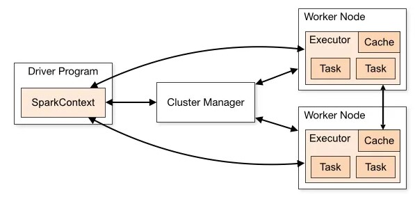

# 🚀 Apache Spark - Complete Presentation

## Table of Contents

- [What is Apache Spark](#what-is-apache-spark)
- [Spark and Hadoop](#spark-and-hadoop)
- [Spark Architecture](#spark-rchitecture)
  - [Introduction](#introduction)
  - [Features of Apache Spark](#features-of-apache-spark)
  - [Key concepts in Spark]("key-concepts-in-spark)
- [Available APIs](#available-apis)
  - [RDD](#rdd)
  - [DataFrame](#dataframe)
  - [DataSet](#dataset)
- [Execution mode](#execution-mode)

## What is Apache Spark

Apache Spark is an open-source distributed data processing engine designed for big data workloads. Knowns for speed and efficiency thanks to its **in-memory execution** capabilities and optimized data processing techniques.It supports a variety of workloads, including:

- Batch processing
- Streaming
- Machine learning
- Graph processing

- Apache Spark Core : It provides distributed task distribution, scheduling, and basic read/write functionalities.
- Spark SQL: Spark SQL is a module in Spark that provides a programming interface for querying structured and semi-structured data using SQL, HiveQL, or DataFrame APIs.
- Spark Streaming: Spark Streaming enables processing and analyzing real-time streaming data. It ingests data in mini-batches and performs parallel processing on the live data stream.
- MLlib (librairie Machine Learning): is Spark’s scalable machine learning library.
- GraphX: is a graph processing library that provides an API for graph computation and analysis.

Advantages of Spark

• In-Memory Processing(speed): Spark leverages in-memory computing to store and process data in memory, resulting in significantly faster data processing compared to disk-based systems like Hadoop MapReduce. By minimizing disk I/O.
• Distributed Computing: Spark distributes data and computation across multiple nodes in a cluster, enabling parallel processing and efficient resource utilization. It automatically manages task scheduling, data partitioning, and fault tolerance, ensuring scalability and high availability.
• Broad Language Support: supports multiple programming languages, including Scala, Java, Python, and R.
• Integration with Big Data Ecosystem: Spark integrates well with various data storage systems and technologies, including Hadoop Distributed File System (HDFS), HBase, Cassandra, and Amazon S3. It can read and write data from different sources

## Spark and Hadoop

Spark can use Hadoop in two ways — one is storage and the second is processing. Since Spark has its own cluster management computation, it uses Hadoop for storage purposes only.

Hadoop is a Big Data ecosystem composed of several components:

- HDFS (Hadoop Distributed File System) → a distributed file system

- YARN (Yet Another Resource Negotiator) → a resource manager for executing tasks across a cluster

- MapReduce → the original batch processing engine (now gradually replaced by Spark)

Spark was created to replace MapReduce by being:

- faster (thanks to in-memory processing)

- more flexible (supports streaming, SQL, machine learning, etc.)

Spark is not a full replacement for Hadoop, but rather a modern processing engine that can integrate with Hadoop.Hadoop is still useful for storage (via HDFS) and resource management (via YARN).Spark replaces MapReduce, but does not replace the entire Hadoop ecosystem

Spark does **not require Hadoop**, but can integrate with it:

- **HDFS**: Spark can read/write data stored in Hadoop Distributed File System
- **YARN**: Spark can run on Hadoop YARN to manage cluster resources
- Spark often **replaces Hadoop MapReduce** as a faster, in-memory processing alternative

## Spark Architecture

1. The Spark driver: is the program or process responsible for coordinating the execution of the Spark application. It runs the main function and creates the SparkContext, which connects to the cluster manager.
2. The Spark executors: are worker processes responsible for executing tasks in Spark applications. Executors run tasks concurrently and store data in memory or disk for caching and intermediate storage.
3. The cluster manager: is responsible for allocating resources and managing the cluster on which the Spark application runs. Spark supports various cluster managers like Apache Mesos, Hadoop YARN, and standalone cluster manager.
4. sparkContext: is the entry point for any Spark functionality. It represents the connection to a Spark cluster and can be used to create RDDs (Resilient Distributed Datasets), accumulators, and broadcast variables. SparkContext also coordinates the execution of tasks.
5. Task: A task is the smallest unit of work in Spark.

Spark consists of several key components:

- **Driver**: orchestrates execution, transforms code into tasks
- **Executors**: run the tasks on cluster nodes
- **Cluster Manager**: manages resources (YARN, Kubernetes, or Standalone)
- **DAG Scheduler**: builds an optimized Directed Acyclic Graph of stages and tasks

## Available APIs

### RDD

Resilient Distributed Dataset :

- Low-level abstraction
- Immutable collections of distributed objects
- Functional-style operations like `map`, `filter`, `reduce`

### DataFrame

- Higher-level API with schema
- Optimized via Catalyst optimizer
- Supports SQL queries

### Dataset

- Strongly-typed version of DataFrame (Scala/Java only)
- Combines benefits of RDD (type-safety) and DataFrame (performance)

## Execution mode

1. Cluster mode: In cluster mode, a user submits a pre-compiled JAR, Python script, or R script to a cluster manager. The cluster manager then launches the driver process on a worker node inside the cluster, in addition to the executor processes. This means that the cluster manager is responsible for maintaining all Spark Application–related processes.
2. Client mode: is nearly the same as cluster mode except that the Spark driver remains on the client machine that submitted the application. This means that the client machine is responsible for maintaining the Spark driver process, and the cluster manager maintains the executor processes.
3. Local Mode: it runs the entire Spark Application on a single machine. It achieves parallelism through threads on that single machine.

---

## ❓ Typical Interview Questions

- What is the difference between RDD and DataFrame?
- What does the Spark Driver do?
- What is a DAG in Spark?
- Can Spark run without Hadoop?
- What’s the difference between Spark SQL and Spark Streaming?
