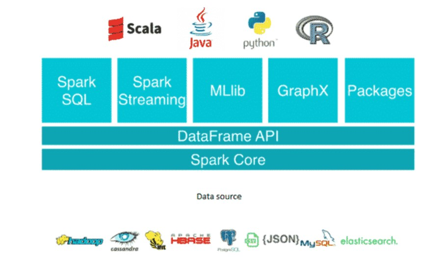

# 🚀 Apache Spark - Complete Presentation

## Table of Contents

- [What is Apache Spark](#what-is-apache-spark)
- [Spark and Hadoop](#spark-and-hadoop)
- [Spark Architecture](#spark-rchitecture)
  - [Introduction](#introduction)
  - [Features of Apache Spark](#features-of-apache-spark)
  - [Key concepts in Spark]("key-concepts-in-spark)
- [Execution mode](#execution-mode)

## What is Apache Spark

Apache Spark is an open-source distributed data processing engine designed for big data workloads. Knowns for speed and efficiency thanks to its **in-memory execution** capabilities and optimized data processing techniques.It supports a variety of workloads, including:

- Batch processing
- Streaming
- Machine learning
- Graph processing

- Apache Spark Core : It provides distributed task distribution, scheduling, and basic read/write functionalities.
- Spark SQL: Spark SQL is a module in Spark that provides a programming interface for querying structured and semi-structured data using SQL, HiveQL, or DataFrame APIs.
- Spark Streaming: Spark Streaming enables processing and analyzing real-time streaming data. It ingests data in mini-batches and performs parallel processing on the live data stream.
- MLlib (librairie Machine Learning): is Spark’s scalable machine learning library.
- GraphX: is a graph processing library that provides an API for graph computation and analysis.

## Spark and Hadoop

Spark can use Hadoop in two ways — one is storage and the second is processing. Since Spark has its own cluster management computation, it uses Hadoop for storage purposes only.

Hadoop is a Big Data ecosystem composed of several components:

- HDFS (Hadoop Distributed File System) → a distributed file system

- YARN (Yet Another Resource Negotiator) → a resource manager for executing tasks across a cluster

- MapReduce → the original batch processing engine (now gradually replaced by Spark)

Spark was created to replace MapReduce by being:

- faster (thanks to in-memory processing)

- more flexible (supports streaming, SQL, machine learning, etc.)

Spark is not a full replacement for Hadoop, but rather a modern processing engine that can integrate with Hadoop.Hadoop is still useful for storage (via HDFS) and resource management (via YARN).Spark replaces MapReduce, but does not replace the entire Hadoop ecosystem

## Spark Architecture

Spark consists of several key components:

- **Driver**: orchestrates execution, transforms code into tasks
- **Executors**: run the tasks on cluster nodes
- **Cluster Manager**: manages resources (YARN, Kubernetes, or Standalone)
- **DAG Scheduler**: builds an optimized Directed Acyclic Graph of stages and tasks

## 🔗 Integration with Hadoop

Spark does **not require Hadoop**, but can integrate with it:

- **HDFS**: Spark can read/write data stored in Hadoop Distributed File System
- **YARN**: Spark can run on Hadoop YARN to manage cluster resources
- Spark often **replaces Hadoop MapReduce** as a faster, in-memory processing alternative

## 🧠 Core Components

- **Spark Core**: the base execution engine
- **Spark SQL**: for querying structured data using SQL or DataFrame API
- **Spark Streaming**: for real-time processing
- **MLlib**: for distributed machine learning
- **GraphX**: for graph processing and graph algorithms

---

## 🔄 Available APIs

### RDD (Resilient Distributed Dataset)

- Low-level abstraction
- Immutable collections of distributed objects
- Functional-style operations like `map`, `filter`, `reduce`

### DataFrame

- Higher-level API with schema
- Optimized via Catalyst optimizer
- Supports SQL queries

### Dataset

- Strongly-typed version of DataFrame (Scala/Java only)
- Combines benefits of RDD (type-safety) and DataFrame (performance)

---

## ⚡ Advantages of Spark

- **In-memory computation** leads to high speed
- Unified ecosystem: batch, streaming, SQL, ML, graph
- Scalable across clusters with thousands of nodes
- Integrates with many data sources: HDFS, S3, Hive, Cassandra, JDBC, etc.

---

## ❓ Typical Interview Questions

- What is the difference between RDD and DataFrame?
- What does the Spark Driver do?
- What is a DAG in Spark?
- Can Spark run without Hadoop?
- What’s the difference between Spark SQL and Spark Streaming?
